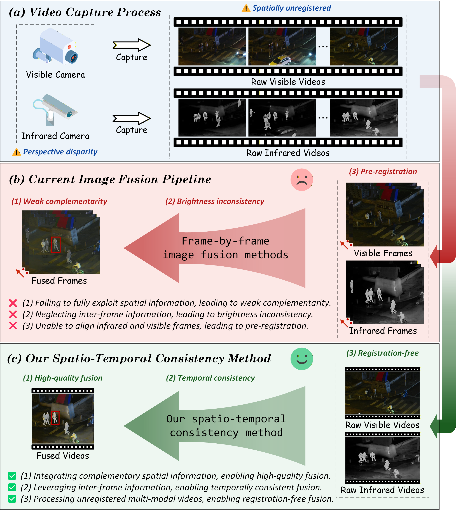
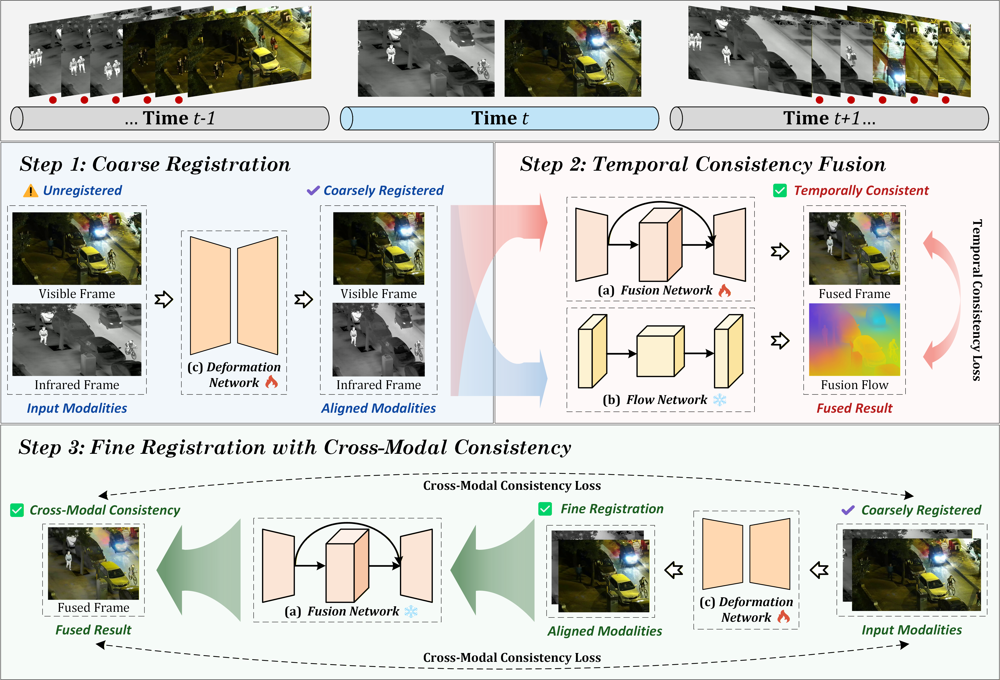

<h1 align="center">
  CMVF：基于时空一致性的跨模态未配准视频融合
</h1>

<p align="center">
  <strong>基于时空一致性的跨模态未配准视频融合方法</strong>
</p>

<p align="center">
  Jianfeng Ding, Hao Zhang, Zhongyuan Wang, Jinsheng Xiao, Xin Tian, Zhen Han, Jiayi Ma
</p>

<p align="center">
  <a href="README.md">English</a> | 简体中文
</p>

<p align="center">
  <a href="https://github.com/jianfeng0369/CMVF"></a>
  <a href="https://doi.org/10.1016/j.inffus.2026.104212"></a>
  <a href="https://github.com/jianfeng0369/VidLLVIP"></a>
  <a href="https://huggingface.co/datasets/jianfeng0369/VidLLVIP"></a>
</p>

CMVF 是一种基于时空一致性的跨模态未配准视频融合方法，面向可能存在空间偏移的红外与可见光视频输入。方法包含粗配准、时间一致性融合，以及带跨模态一致性的精配准，用于生成高质量、稳定且对齐的视频融合结果。

## 📰 新闻

- 🚀 **2026-05-06**：我们发布了 [VidLLVIP 数据集](https://github.com/jianfeng0369/VidLLVIP)。
- 🎉 **2026-02-05**：我们的多模态视频融合论文 [CMVF](https://doi.org/10.1016/j.inffus.2026.104212) 被 *Information Fusion* 接收，代码已发布在 [CMVF GitHub 仓库](https://github.com/jianfeng0369/CMVF)。

## 研究动机

<p align="center">
  
</p>

<p align="center">
  <sub><em><strong>图 1.</strong> (a) 实际应用中的跨模态数据采集。 (b) 图像融合主要利用多源静态信息，缺少对原始数据中时空信息的整合。 (c) 视频融合能够以端到端方式结合空间、时间和跨模态信息，生成高质量、稳定且对齐的视频。</em></sub>
</p>

## 方法概览

<p align="center">
  
</p>

<p align="center">
  <sub><em><strong>图 2.</strong> CMVF 框架包含三个主要步骤：粗配准、时间一致性融合，以及带跨模态一致性的精配准。</em></sub>
</p>

## 准备环境

1. 克隆仓库：

```bash
git clone https://github.com/jianfeng0369/CMVF.git
cd CMVF
```

2. 创建 conda 环境并安装依赖：

```bash
conda create -n cmvf python=3.10
conda activate cmvf
pip install -r requirements.txt
```

## 融合测试

1. 将图像放入 `data/images`，将视频放入 `data/videos`，并确保成对的红外与可见光输入文件名一致。

2. 修改 `test_*.py` 中的 `path_vi`、`path_ir` 和 `path_op` 变量，使其指向你的数据路径。

3. 运行图像融合测试：

```bash
python test_images.py
```

4. 运行视频融合测试：

```bash
python test_videos.py
```

## 引用

如果本工作对你的研究有帮助，请考虑引用：

### CMVF

```bibtex
@article{cmvf2026ding,
  title   = {CMVF: Cross-modal unregistered video fusion via spatio-temporal consistency},
  journal = {Information Fusion},
  volume  = {132},
  pages   = {104212},
  year    = {2026},
  issn    = {1566-2535},
  author  = {Jianfeng Ding and Hao Zhang and Zhongyuan Wang and Jinsheng Xiao and Xin Tian and Zhen Han and Jiayi Ma}
}
```

### VidLLVIP

如果你使用 VidLLVIP 处理版数据、配准矩阵或预处理流程，请同时引用 VidLLVIP：

```bibtex
@dataset{ding2026vidllvip,
  author  = {Ding, Jianfeng},
  title   = {VidLLVIP: A visible-infrared paired video dataset for low-light vision},
  year    = {2026},
  version = {v1.0.0},
  url     = {https://github.com/jianfeng0369/VidLLVIP}
}
```

## 开源协议

本项目基于 [MIT License](LICENSE) 发布。

## 联系方式

如有任何问题，请通过以下邮箱联系：<jianfeng0369@gmail.com>。
